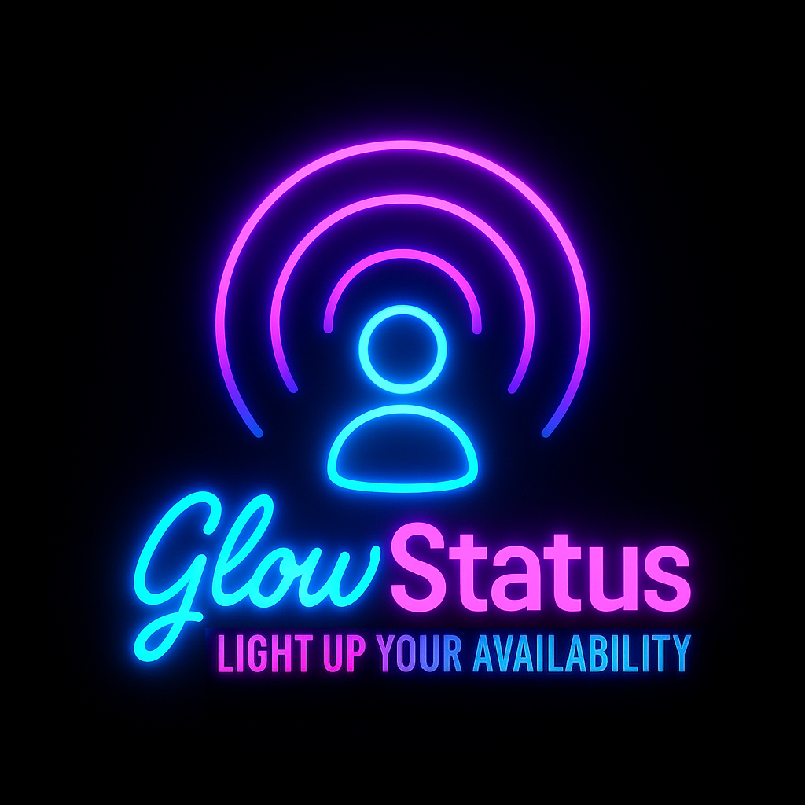

# 🌟 GlowStatus

**Smart Presence Indicator with Govee + Google Calendar**

GlowStatus is a cross-platform status indicator system that syncs your Govee smart lights with your Google Calendar, showing your availability at a glance. Perfect for home offices, shared spaces, and remote work.

---

## 🚀 Features

- **Real-time Meeting & Focus Detection** – Syncs with Google Calendar to detect your status, including custom "focus" events (case-insensitive, matches anywhere in event title).
- **Smart Light Control** – Uses Govee API to change light colors based on your calendar status.
- **Configurable Modes** – Custom color themes for:
  - In a Meeting (red)
  - Focus Mode (blue)
  - Available (green)
  - Offline (gray)
  - Add your own status keywords and colors!
- **Secure by Default** – All configuration is handled via a graphical UI (no manual file editing or `.env` required for users).
- **Manual Override & Tray Icon** – Change your status or open settings from the system tray.
- **Tray Icon Picker** – Choose your tray icon from any image in `/img` with `_tray_` in the filename.
- **Persistent Sync State** – Sync on/off state is remembered between runs.
- **Efficient Calendar Sync** – Only fetches events from the last 15 minutes up to midnight, for fast performance even on busy calendars.
- **Mobile & Codespace Friendly** – CLI/manual config possible for advanced/dev use.
- **Secure by Default** – Uses `.env` for secure API key and token management in dev.
- **Mobile & Codespace Friendly** – Works on iPad via GitHub Codespaces.

---

## 📦 Project Structure

```
GlowStatus/
├── src/
│   ├── glowstatus.py           # Main control logic
│   ├── govee_controller.py     # Govee API integration
│   ├── calendar_sync.py        # Google Calendar sync logic
│   ├── logger.py               # Logging utilities
│   ├── utils.py                # Helper functions
│   ├── config_ui.py            # Configuration UI for setup
│   └── tray_app.py             # System tray app entrypoint
├── config/
│   ├── glowstatus_config.json  # User configuration (auto-generated)
│   └── google_token.pickle     # Google OAuth token (auto-generated)
├── resources/
│   └── client_secret.json      # Google OAuth client secret (bundled)
├── img/
│   └── GlowStatus_tray_*.png   # Tray icon images (selectable)
├── tests/
│   └── test_main.py            # Unit tests
├── docs/
│   ├── govee_apikey_instructions.md
│   ├── govee_device_id_instructions.md
│   └── google_calendar_apikey_instructions.md
├── requirements.txt            # Python dependencies
├── README.md                   # You're here!
└── LICENSE                     # MIT License
```

---

## 🛠️ Setup Instructions

### [macOS Local Development Setup](#macos-local-development-setup)
### [Windows Local Development Setup](#windows-local-development-setup)

1. **Clone the Repo**
   ```bash
   git clone https://github.com/Severswoed/GlowStatus.git
   cd GlowStatus
   ```

2. **Install Dependencies**
   ```bash
   python -m venv .venv
   .\.venv\Scripts\Activate
   pip install -r requirements.txt
   ```

3. **Launch the App (with Tray Icon)**
   ```bash
   python src/tray_app.py
   ```
   - Click the GlowStatus tray icon and select **"Open Settings"** to enter your Govee and Google details, connect your Google account, and customize status colors and options.
   - All settings are saved securely—no manual file editing required!

4. **(Optional) Run the Main App Directly**
   ```bash
   python src/glowstatus.py
   ```
   - This will use your saved config and secrets.

---

## ⚙️ Settings & Options

- **Govee API Key, Device ID, Device Model:**  
  Enter your Govee credentials in the settings window.

- **Google OAuth:**  
  Click "Connect Google Calendar (OAuth)" and sign in.  
  Select your calendar from the dropdown (all calendars you have access to will be listed).

- **Tray Icon:**  
  Pick any image from `/img` with `_tray_` in the filename to use as your system tray icon.  
  The tray icon and the app's taskbar/dock icon will both show your chosen logo for a seamless experience on Windows and macOS.

- **Status/Color Mapping:**  
  Add, edit, or remove status keywords (e.g., `focus`, `in_meeting`, `available`, `lunch`, etc.) and assign RGB colors and a "Power Off" option for each. 

  - **To add a custom status:** Click "Add Status" in the settings window, enter your keyword (e.g., `lunch`), set a color (or leave blank), and check "Power Off" if you want the light to turn off for that status.

  - **Behavior:** If "Power Off" is checked, the light will turn off for that status, regardless of color. Otherwise, the light will use the specified color.
  - Status detection is **case-insensitive** and matches keywords anywhere in the event title.

- **Refresh Interval:**  
  Set how often (in seconds) the app checks your calendar for status changes.

- **Disable Calendar Sync:**  
  Temporarily disables automatic status updates from your calendar.

- **Power Off When Available:**  
  Turns off your Govee light when your status is "available" (optional).

- **Turn Lights Off for Unknown Status:**  
  If enabled, the light turns off when your status doesn't match any keyword; otherwise, it turns white.

- **Manual Override:**  
  Use the tray menu to set your status manually.  
  Clear override to return to automatic calendar-based status.

- **Persistent Sync State:**  
  The app remembers whether sync was enabled or disabled between runs.

---

## ✨ Cool Feature: Meeting Reminder via Lights

Ever been off in space, deep in thought, working on something intently... and suddenly your lights come on?  
That's GlowStatus giving you a heads-up:  **"Oh crap, I have a minute or so to get to the meeting!"**  
Thanks to GlowStatus, you'll never miss that last-minute dash—your lights will gently remind you when a meeting is about to start.

You'll never shine if you dont glow ✨

---

## 🧑‍💻 macOS Local Development Setup

1. **Install Python 3.9+**  
   You can use [Homebrew](https://brew.sh/):
   ```bash
   brew install python
   ```

2. **(Recommended) Create a Virtual Environment**
   ```bash
   python3 -m venv venv
   source venv/bin/activate
   ```

3. **Install Dependencies**
   ```bash
   pip3 install -r requirements.txt
   ```

4. **Continue with the main setup instructions above.**

---

## 🖥️ Windows Local Development Setup

1. **Install Python 3.9+**  
   Download from [python.org](https://www.python.org/downloads/windows/) and ensure "Add Python to PATH" is checked.

2. **(Recommended) Create a Virtual Environment**
   ```powershell
   python -m venv venv
   .\venv\Scripts\activate
   ```

3. **Install Dependencies**
   ```powershell
   pip install -r requirements.txt
   ```

4. **Continue with the main setup instructions above.**

---

## 🧪 Example `.env`

```env
# .env.example
GOVEE_API_KEY=your-govee-api-key
GOVEE_DEVICE_ID=your-light-device-id
GOVEE_DEVICE_MODEL=your-device-model
GOOGLE_CALENDAR_ID=your_email@gmail.com
GOOGLE_SERVICE_ACCOUNT_JSON=./google_service_account.json
REFRESH_INTERVAL=60
DISABLE_CALENDAR_SYNC=0
POWER_OFF_WHEN_AVAILABLE=1
```

---

## 🧑‍💻 Codespaces/iPad Quick Start

> **Note:** The configuration UI requires a desktop environment. For Codespaces or iPad, edit `config/glowstatus_config.json` manually and use the CLI.

**Alternative:**  
You can also pull the `v1.0-MVP` branch to run GlowStatus locally in CLI mode with no GUI:
```bash
git fetch origin v1.0-MVP
git checkout v1.0-MVP
python src/glowstatus.py
```
This is ideal for headless, remote, or minimal environments.

---

## 🔑 API & Device Setup

- **Govee API Key:**  
  See [docs/govee_apikey_instructions.md](./docs/govee_apikey_instructions.md)

- **Govee Device ID:**  
  See [docs/govee_device_id_instructions.md](./docs/govee_device_id_instructions.md)

- **Google Calendar API Credentials:**  
  See [docs/google_calendar_apikey_instructions.md](./docs/google_calendar_apikey_instructions.md)

---

## 🛠️ Troubleshooting

- **Tray icon or config UI does not appear:**  
  Make sure you are running the app on a desktop environment (not Codespaces or iPad browser).

- **Govee device not responding:**  
  Double-check your API key, device ID, and model. See [Govee API Key Instructions](./docs/govee_apikey_instructions.md).

- **Status colors not changing:**  
  Ensure your status keywords and color mappings are correct in the config UI.

- **Missing `client_secret.json`:**  
  This file should be bundled in `resources/` with your app. If missing, contact the app maintainer.

- **Manual override not working:**  
  Make sure you clear manual override from the tray menu if you want to return to automatic status.

- **Other errors:**  
  Check the logs for details. File an issue if you need help!

---

## 🎯 Future Roadmap

- Slack/Teams status sync
- Time-based or ambient-light auto dimming
- More integrations and automations

**5-Minute Meeting Reminder:**  
  Show a tooltip notification over the tray icon 5 (x) minutes before an upcoming meeting.

---

## 📋 License

MIT License — see [LICENSE](./LICENSE) for full details.

---

## 💬 Feedback & Contributions

Ideas? Bugs? PRs are welcome. File an issue or start a discussion!

---

### 🔗 Related Projects
- [Govee Developer Portal](https://developer.govee.com)
- [Google Calendar API Docs](https://developers.google.com/calendar/api)

---

Light up your availability! 💙