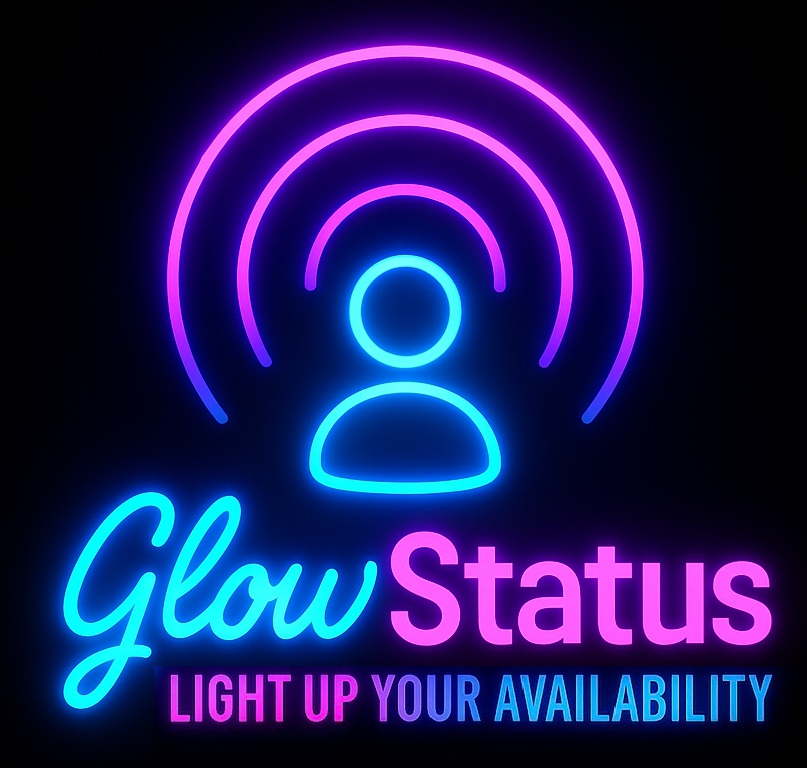

# 🌟 GlowStatus

**Smart Presence Indicator with Govee + Google Calendar**

GlowStatus is a cross-platform status indicator system that syncs your Govee smart lights with your Google Calendar, showing your availability at a glance. Perfect for home offices, shared spaces, and remote work.

---

## 🚀 Features

- **Real-time Meeting & Focus Detection** – Syncs with Google Calendar to detect your status, including custom "focus" events (case-insensitive, matches anywhere in event title).
- **Smart Light Control** – Uses Govee API to change light colors based on your calendar status.
- **Configurable Modes** – Custom color themes for:
  - In a Meeting (red)
  - Focus Mode (blue)
  - Available (green)
  - Offline (gray)
  - Add your own status keywords and colors!
- **Secure by Default** – All configuration is handled via a graphical UI (no manual file editing or `.env` required for users).
- **Manual Override & Tray Icon** – Change your status or open settings from the system tray.
- **Tray Icon Picker** – Choose your tray icon from any image in `/img` with `_tray_` in the filename.
- **Persistent Sync State** – Sync on/off state is remembered between runs.
- **Efficient Calendar Sync** – Only fetches events from the last 15 minutes up to midnight, for fast performance even on busy calendars.
- **Mobile & Codespace Friendly** – CLI/manual config possible for advanced/dev use, works on iPad via GitHub Codespaces.
- **Discord Community** – Join our Discord server for support, feature requests, and to show off your GlowStatus setup!

---

## 📦 Project Structure

```
GlowStatus/
├── src/
│   ├── glowstatus.py           # Main control logic
│   ├── govee_controller.py     # Govee API integration
│   ├── calendar_sync.py        # Google Calendar sync logic
│   ├── logger.py               # Logging utilities
│   ├── utils.py                # Helper functions
│   ├── config_ui.py            # Configuration UI for setup
│   └── tray_app.py             # System tray app entrypoint
├── config/
│   ├── glowstatus_config.json  # User configuration (auto-generated)
│   └── google_token.pickle     # Google OAuth token (auto-generated)
├── resources/
│   └── client_secret.json      # Google OAuth client secret (bundled)
├── img/
│   └── GlowStatus_tray_*.png   # Tray icon images (selectable)
├── tests/
│   ├── test_main.py               # Unit tests + final verification
│   ├── test_token_robustness.py   # OAuth token error handling tests
│   └── readme_tests.md            # Testing documentation
├── discord/
│   ├── setup_discord.py        # Discord server automation
│   ├── README.md               # Discord setup guide
│   └── webhooks.json           # GitHub integration template
├── docs/
│   ├── govee_apikey_instructions.md
│   ├── govee_device_id_instructions.md
│   └── google_calendar_apikey_instructions.md
├── requirements.txt            # Python dependencies
├── README.md                   # You're here!
└── LICENSE                     # MIT License
```

---

## ⚙️ Settings & Options

- **Govee API Key, Device ID, Device Model:**  
  Enter your Govee credentials in the settings window.

- **Google OAuth:**  
  Click "Connect Google Calendar (OAuth)" and sign in.  
  Select your calendar from the dropdown (all calendars you have access to will be listed).

- **Tray Icon:**  
  Pick any image from `/img` with `_tray_` in the filename to use as your system tray icon.  
  The tray icon and the app's taskbar/dock icon will both show your chosen logo for a seamless experience on Windows and macOS.

- **Status/Color Mapping:**  
  Add, edit, or remove status keywords (e.g., `focus`, `in_meeting`, `available`, `lunch`, etc.) and assign RGB colors and a "Power Off" option for each. 

  - **To add a custom status:** Click "Add Status" in the settings window, enter your keyword (e.g., `lunch`), set a color (or leave blank), and check "Power Off" if you want the light to turn off for that status.

  - **Behavior:** If "Power Off" is checked, the light will turn off for that status, regardless of color. Otherwise, the light will use the specified color.
  - Status detection is **case-insensitive** and matches keywords anywhere in the event title.

- **Refresh Interval:**  
  Set how often (in seconds) the app checks your calendar for status changes.

- **Disable Calendar Sync:**  
  Temporarily disables automatic status updates from your calendar.

- **Power Off When Available:**  
  Turns off your Govee light when your status is "available" (optional).

- **Turn Lights Off for Unknown Status:**  
  If enabled, the light turns off when your status doesn't match any keyword; otherwise, it turns white.

- **Manual Override:**  
  Use the tray menu to set your status manually.  
  Clear override to return to automatic calendar-based status.

- **Persistent Sync State:**  
  The app remembers whether sync was enabled or disabled between runs.

---

## ✨ Cool Feature: Meeting Reminder via Lights

Ever been off in space, deep in thought, working on something intently... and suddenly your lights come on?  
That's GlowStatus giving you a heads-up:  **"Oh crap, I have a minute or so to get to the meeting!"**  
Thanks to GlowStatus, you'll never miss that last-minute dash—your lights will gently remind you when a meeting is about to start.

You'll never shine if you dont glow ✨

---

## 🔆 Wall of Glow

Thanks to these amazing sponsors who help keep GlowStatus glowing bright! ✨

*[Become a sponsor](https://github.com/sponsors/Severswoed) and join the Wall of Glow!*

---

## 🔑 API & Device Setup

- **Govee API Key:**  
  See [docs/govee_apikey_instructions.md](./docs/govee_apikey_instructions.md)

- **Govee Device ID:**  
  See [docs/govee_device_id_instructions.md](./docs/govee_device_id_instructions.md)

- **Google Calendar API Credentials:**  
  See [docs/google_calendar_apikey_instructions.md](./docs/google_calendar_apikey_instructions.md)

---

## 💬 Community & Support

### 🎮 Join Our Discord Community

Connect with the GlowStatus community - a focused space for smart lighting enthusiasts, remote workers, and developers building the future of presence indicators.

**Why Join?**
- **🆘 Expert Support** - Get help from experienced users and developers
- **💡 Shape Development** - Your feature requests directly influence our roadmap
- **🔧 Hardware Integration** - Request support for new smart light brands and devices
- **📸 Setup Inspiration** - See creative GlowStatus configurations from the community
- **🔨 Early Access** - Be first to know about new features and beta releases
- **☕ Network** - Connect with other remote workers optimizing their home office setups

**[Join Discord Server](https://discord.gg/glowstatus)** 🚀

Our Discord follows proven community best practices:
- **Focused Topic**: Everything relates to smart lighting and productivity
- **Quality Discussions**: No spam bots or off-topic noise
- **Expert Moderation**: Automated security with human oversight
- **Growth-Oriented**: Built to scale from early adopters to thousands of users

### 📋 Community Channels

**🟢 Info & Announcements**
- **#welcome** - Quick intro with essential links and channel guide
- **#rules** - Community guidelines and code of conduct
- **#announcements** - Official releases, roadmap updates, and major news

**🔧 Support & Feedback**  
- **#setup-help** - Installation troubleshooting and configuration questions
- **#feature-requests** - Community-driven development ideas and voting
- **#integration-requests** - Request support for new hardware brands

**🔨 Development**
- **#dev-updates** - Automated GitHub activity feed (commits, releases, issues)
- **#cli-version-v1** - Legacy CLI version support and discussion
- **#app-version-v2** - Current GUI version questions and feedback
- **#api-dev** - Technical API and integration discussions

**☕ Community**
- **#general** - Remote work tips, productivity discussions, general chat
- **#show-your-glow** - Share photos and videos of your GlowStatus setup

### 🎯 Community Goals

Following successful Discord community patterns:
- **Quality over Quantity**: Engaged users who actually use GlowStatus
- **Educational Focus**: Share knowledge about smart lighting and productivity
- **Collaborative Development**: Community input drives feature priorities
- **Supportive Environment**: Help newcomers get their lights working perfectly

---

## 🛠️ Troubleshooting

- **Tray icon or config UI does not appear:**  
  Make sure you are running the app on a desktop environment (not Codespaces or iPad browser).

- **Govee device not responding:**  
  Double-check your API key, device ID, and model. See [Govee API Key Instructions](./docs/govee_apikey_instructions.md).

- **Status colors not changing:**  
  Ensure your status keywords and color mappings are correct in the config UI.

- **Missing `client_secret.json`:**  
  This file should be bundled in `resources/` with your app. If missing, contact the app maintainer.

- **Manual override not working:**  
  Make sure you clear manual override from the tray menu if you want to return to automatic status.

- **Other errors:**  
  Check the logs for details. File an issue if you need help!

- **Discord Bot Permission Errors:**  
  If setting up your own Discord server, ensure the bot has Administrator permissions or all required individual permissions (Manage Server, Manage Roles, Manage Channels, Manage Webhooks). Enable "Server Members Intent" and "Message Content Intent" in the Discord Developer Portal.

---

## 🧪 Testing

GlowStatus includes a comprehensive test suite that covers all major functionality including configuration management, Google Calendar integration, Govee smart light control, and application logic.

```bash
# Run all tests
python tests/final_test_verification.py

# Run comprehensive verification
python tests/final_test_verification.py
```

✅ **Comprehensive Coverage** • ✅ **Headless Compatible** • ✅ **Mocked Dependencies** • ✅ **Bug Protection**

For detailed testing documentation, test categories, and individual test instructions, see **[tests/readme_tests.md](tests/readme_tests.md)**.

---

## 🎯 Future Roadmap

- Slack/Teams status sync
- Time-based or ambient-light auto dimming
- More integrations and automations

**5-Minute Meeting Reminder:**  
  Show a tooltip notification over the tray icon 5 (x) minutes before an upcoming meeting.

---

## 📋 License

MIT License — see [LICENSE](./LICENSE) for full details.

---

## 💬 Feedback & Contributions

**Got questions? Join our [Discord Server](https://discord.gg/glowstatus)** for real-time help and community support!

Ideas? Bugs? PRs are welcome. File an issue or start a discussion!

**Ways to Contribute:**
- 🐛 Report bugs and issues
- 💡 Suggest new features in Discord
- 🔧 Submit pull requests
- 📖 Improve documentation
- 🎨 Share your setup photos
- ⭐ Star the repository if you find it useful!

---

### 🔗 Related Projects
- [Govee Developer Portal](https://developer.govee.com)
- [Google Calendar API Docs](https://developers.google.com/calendar/api)
- [GlowStatus Discord Community](https://discord.gg/glowstatus)

---

Light up your availability! 💙