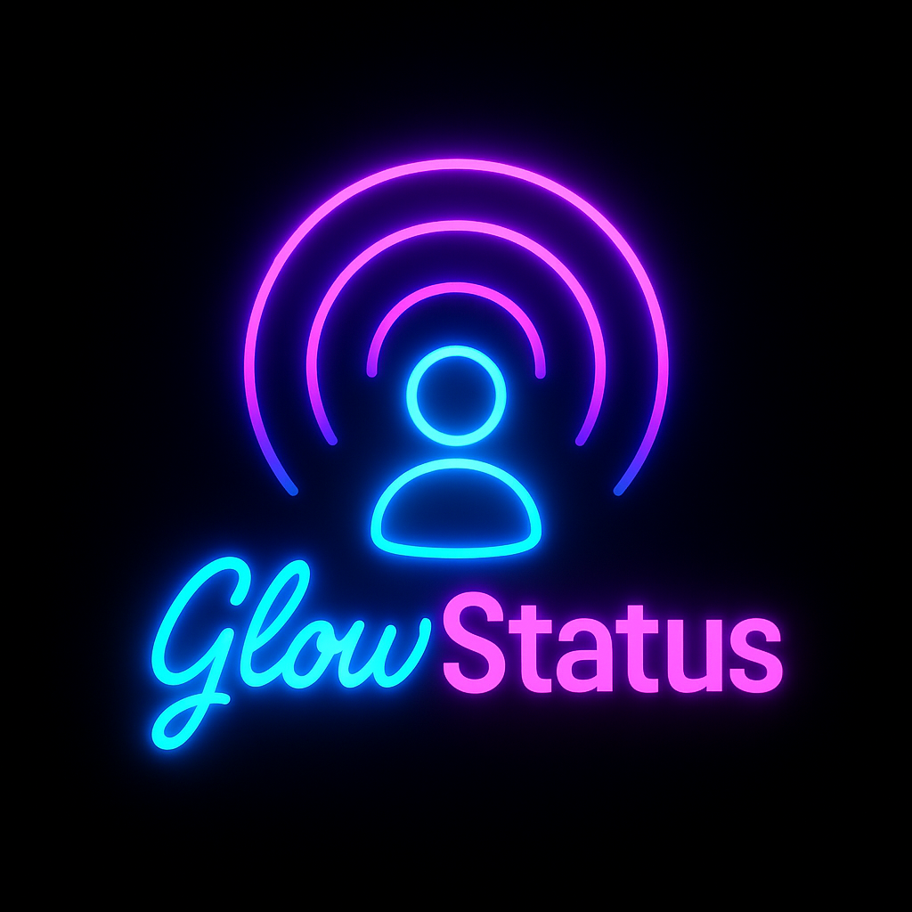

# 🌟 GlowStatus

**Smart Presence Indicator with Govee + Google Calendar**

GlowStatus is a cross-platform status indicator system that syncs your Govee smart lights with your Google Calendar, showing your availability at a glance. Perfect for home offices, shared spaces, and remote work.

---

## 🚀 Features

- **Real-time Meeting Detection** – Syncs with Google Calendar to detect your meeting status.
- **Smart Light Control** – Uses Govee API to change light colors based on presence.
- **Configurable Modes** – Custom color themes for:
  - In a Meeting
  - Available
  - Focus Mode
  - Offline
- **Secure by Default** – Uses `.env` for secure API key and token management.
- **Mobile & Codespace Friendly** – Works on iPad via GitHub Codespaces.

---

## 📦 Project Structure

```
GlowStatus/
├── src/
│   ├── glowstatus.py           # Main control logic
│   ├── govee_controller.py     # Govee API integration
│   ├── calendar_sync.py        # Google Calendar sync logic
│   ├── logger.py               # Logging utilities
│   └── utils.py                # Helper functions
├── tests/
│   └── test_main.py            # Unit tests
├── docs/
│   ├── govee_apikey_instructions.md
│   ├── govee_device_id_instructions.md
│   └── google_calendar_apikey_instructions.md
├── .env.example                # Sample env config
├── requirements.txt            # Python dependencies
├── README.md                   # You're here!
└── LICENSE                     # MIT License
```

---

## 🛠️ Setup Instructions

1. **Clone the Repo**
   ```bash
   git clone https://github.com/Severswoed/GlowStatus.git
   cd GlowStatus
   ```

2. **Install Dependencies**
   ```bash
   pip install -r requirements.txt
   ```

3. **Create and Configure `.env`**
   ```bash
   cp .env.example .env
   # Fill in Govee API Key, Device ID, Google Calendar ID, and service account JSON path.
   ```

4. **Run the App**
   ```bash
   python src/glowstatus.py
   ```

---

## 🧪 Example `.env`

```env
# .env.example
GOVEE_API_KEY=your-govee-api-key
GOVEE_DEVICE_ID=your-light-device-id
GOVEE_DEVICE_MODEL=your-device-model
GOOGLE_CALENDAR_ID=your_email@gmail.com
GOOGLE_SERVICE_ACCOUNT_JSON=./google_service_account.json
REFRESH_INTERVAL=60
DISABLE_CALENDAR_SYNC=0
POWER_OFF_WHEN_AVAILABLE=1
```

---

## 🧑‍💻 Codespaces/iPad Quick Start

1. Open your repo in GitHub Codespaces.
2. Install dependencies:
   ```bash
   pip install -r requirements.txt
   ```
3. Copy `.env.example` to `.env` and fill in your credentials:
   ```bash
   cp .env.example .env
   # Edit .env with your API keys and paths
   ```
4. Upload your Google service account JSON file.
5. Start the app:
   ```bash
   python src/glowstatus.py
   ```

---

## 🔑 API & Device Setup

- **Govee API Key:**  
  See [docs/govee_apikey_instructions.md](./docs/govee_apikey_instructions.md)

- **Govee Device ID:**  
  See [docs/govee_device_id_instructions.md](./docs/govee_device_id_instructions.md)

- **Google Calendar API Credentials:**  
  See [docs/google_calendar_apikey_instructions.md](./docs/google_calendar_apikey_instructions.md)

---

## 🧪 CLI Test Example

```bash
curl -X PUT "https://developer-api.govee.com/v1/devices/control" \
  -H "Govee-API-Key: GOVEE_API_KEY" \
  -H "Content-Type: application/json" \
  -d '{
    "device": "GOVEE_DEVICE_ID",
    "model": "GOVEE_DEVICE_MODEL",
    "cmd": {
      "name": "turn",
      "value": "on"
    }
  }'
```
> To turn off, set `"value": "off"`

---

## 🎯 Future Roadmap

- Slack/Teams status sync
- Tray icon/manual override
- Time-based or ambient-light auto dimming
- Config UI for non-technical users

---

## 📋 License

MIT License — see [LICENSE](./LICENSE) for full details.

---

## 💬 Feedback & Contributions

Ideas? Bugs? PRs are welcome. File an issue or start a discussion!

---

### 🔗 Related Projects
- [Govee Developer Portal](https://developer.govee.com)
- [Google Calendar API Docs](https://developers.google.com/calendar/api)

---

Let your **GlowStatus** speak for you! 💙